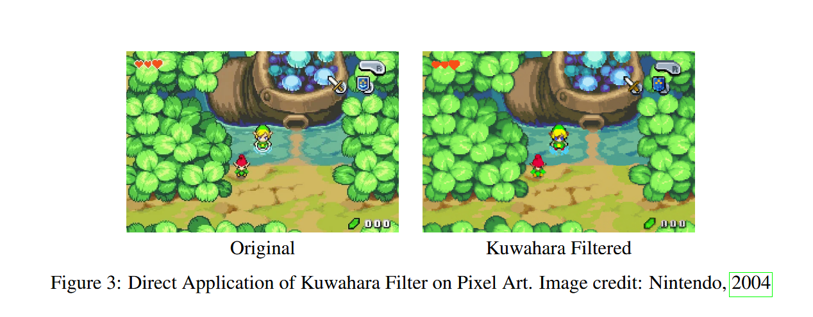
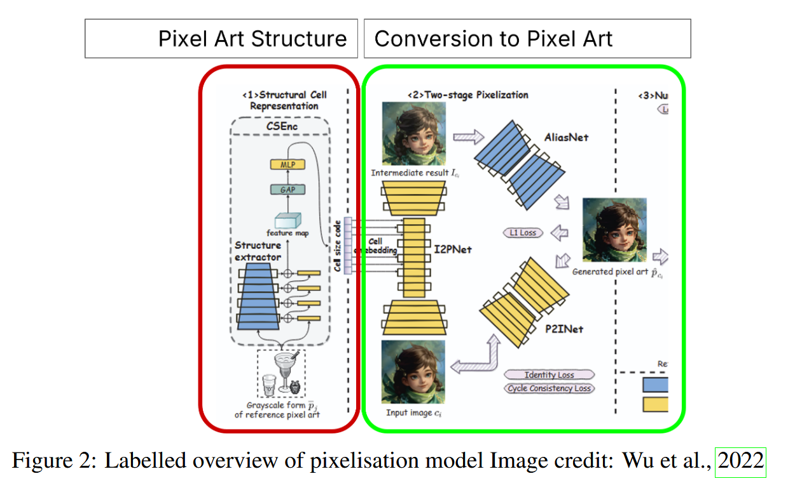
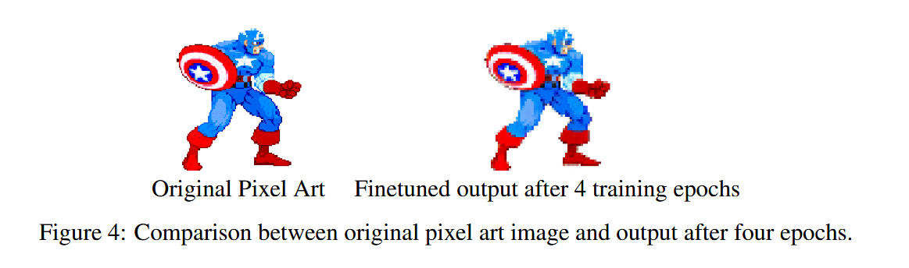

# Project Overview
This project is used to meld an existing pixelisation GAN architecture (https://dl.acm.org/doi/10.1145/3550454.3555482) and hijack the pretrained structure to apply filters to be applied onto a pixelised image. These use 3 models and we attempt to inject images into the architecture to learn features from sets of Kuwahara filtered images while maintaining the pixelisation artstyle. These styles are in opposition with each other, given Kuwahara is a smoothing function as seen below:



Before applying the injection, GAN Discriminator weights needed to be retrained as they were not included in the inherited Github project, which involved freezing the Generator (see line 265 of `./models/pixelization_model.py`):
```
    def backward_G(self,epoch):
        """Calculate the loss for generators G_A and G_B"""
        ...
        # self.loss_G.backward()
```

Finally, to apply the Kuwahara filter, we produce Kuwahara images using `kuwahara.py` on high-resolution images as finetuning data. Looking at the diagram below from the inherited network:



we only require training the I2PNet model (left-most model in green box), placing our high-resolution images on the bottom (Input image) and Kuwahara filtered image on top (Intermediate result). This allows the structure to learn Kuwahara filters and maintin pixelisation, learned by the fixed cell-embedding from the red box. A result from this is given here, applying Kuwahara smoothing while maintaining pixelisation:



 Training code for Pixelisation model is included in train.py, adapted from the original GAN architecture https://github.com/junyanz/pytorch-CycleGAN-and-pix2pix/blob/master/docs/tips.md. The Kuwahara filter is included in `kuwahara.py`, with pre-prep data using `prepare_data.py` and SSIM used to filter our artificial dataset is in `ssim.py`.

 Note the full datasets and model parameters are not included in the final version.